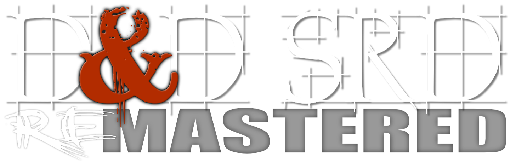

View the [Changelog](https://github.com/OldManUmby/DND.SRD.Wiki/blob/master/Changelog.md)

# REorganized. REpublished. REmastered!

---

### PKM-FRIENDLY!

This adaption of the D&D 5E SRD contains optional content designed specifically for PKM applications like Obsidian. [Obsidian.md](https://obsidian.md) is a powerful knowledge base on top of a local folder of plain text Markdown files. That definition sounds simple; however, Obsidian is much, much more. Visit [Josh Plunket's YouTube Channel](https://www.youtube.com/channel/UCoW2sPmrevk9eiJKcQXeHUQ) to learn more about using Obsidian for your roleplaying game campaign management.

## What is D&D 5E SRD REmastered?

This is an adaptation of the D&D 5E SRD available in Markdown (.MD) for export other publishing formats.

**The Systems Reference Document (SRD)** contains guidelines for publishing content under the Open-Gaming License (OGL). The [Dungeon Masters Guild](http://dungeonmastersguild.com/) also provides self-publishing opportunities for individuals and groups. The OGL and Dungeon Masters Guild offer different kinds of publishing opportunities. For an overview of the programs, please visit the official [Wizards SRD page](http://dnd.wizards.com/articles/features/systems-reference-document-srd) to compare the programs.

**Why Markdown format?** Markdown is a lightweight markup language with plain text formatting syntax created by [John Gruber](https://daringfireball.net). It is designed so that it can be converted to HTML and many other formats using any number of various Markdown editors. Markdown is often used to format readme files, for writing books, blogs and messages, or to simply create rich text using a plain text or markkdown editor. 

The publishing documents contained herein were REmastered line-by-line into Markdown format to be exported and utilized in your own 5E projects. I have painstakingly converted the original Wizard's SRD v5.1 PDF to markdown, plus all errata from the _Nov 2018 update_. For more information please visit our official [Github Public Repo](https://github.com/OldManUmby/DND-SRD5).
