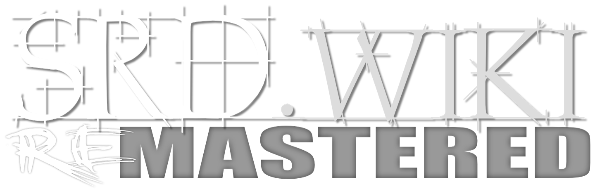

Welcome to the SRD Wiki. This site is dedicated to the Markdown conversion of various OGL roleplaying game rulesets.

> If you are looking for the Dungeons & Dragons 5th Edition SRD REmastered website, please visit [https://dnd.srd.wiki](https://dnd.srd.wiki).

# REorganized. REpublished. REmastered!

---

## What is an SRD?

**A Systems Reference Document (SRD)** contains guidelines for publishing content under the Open-Gaming License (OGL) or another open-style license. The [Dungeons & Dragons SRD](http://dnd.wizards.com/articles/features/systems-reference-document-srd) is the quintessential example, as it provides self-publishing opportunities for individuals, groups, and companies who wish to utilize the official Dungeons & Dragons ruleset in their own published material or games.

## Why Markdown Format?

**Markdown is a lightweight markup language** with plain text formatting syntax created by [John Gruber](https://daringfireball.net). By its very nature, being a plain text file, it is designed to add future-proofing to any set of documents while still maintaining basic text and table formatting options.